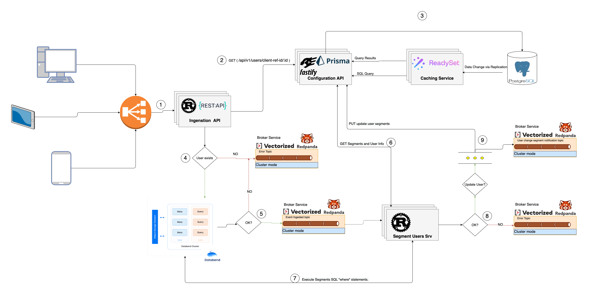

# User Segmentation System (USS) - POC

## Problem Statement
 Design a user segmentation system that can segment users based on their behavior. 
* Site collects user activity data like viewed a page, purchased a product, added to cart, clicked on a page etc. 
* Users have different identities, cookie, user’s email, facebook login etc 
* Segment users based on  
* Users who came from Area X, having not made purchase in last 30 days 
* Users who are mobile users have 10 or more views but have not visited site in last 7 days 
* Segments must be computed in real time so users might be added/removed from segment as they are browsing the site. 
* The service must be scalable and have low latency. 

## Proposed Solution
 * The solution is based on the idea of using a Data analytics database to store the user activity data (events) and using a SQL query language to query the data in real-time.
 * Separate database is used to store the user segments. The user segments are computed in real-time and stored in the database. The user segments are updated as the user activity data is updated.
 * A cache is used for faster DB access. The cache is updated as the user segments are updated.
 * A message queue is used to decouple the ingestion API from the real-time computation of the segments. The ingestion API pushes the user activity data to the message queue. The message queue is consumed by the real-time computation service which computes the segments and updates the database.
 * A microservice architecture is used. The ingestion API , the real-time computation service and the DB Management API are separate services. The services are deployed in separate containers.
 * The solution is scalable and has low latency. The solution can be scaled horizontally by adding more instances of the services or can be scaled vertically by increasing the resources of the services.


## Architecture


### Components 
1. Ingestion API , a Rust based API that accepts user activity data , stores it in the Data analytics database and pushes it to the message queue.
2. Segment Users Srv, a Rust based service that consumes the message queue, computes the user segments and stores them in the user segments database.
3. Configuration API, a Prisma.io based API that manages the database.
4. Postgres DB, a Postgres database that stores the business entities/configuration (users,segments, activities etc). [DB Schema is managed by the Configuration API.](./configuration-api-srv/prisma/schema.prisma)
5. ReadySet, real-time SQL caching layer that for Postgres.Can run in cluster mode[ReadySet](https://readyset.io)
6. Databend DB, an open-source, elastic, and workload-aware cloud data warehouse, a cutting-edge alternative to SnowflakeOpen in the new tab. Developed with RustOpen in the new tab, it's engineered for complex analysis of the world's largest datasets.It supports SQL and can run in cluster mode. [Databend](https://databend.rs/doc/)
7. Redpanda, a Kafka API compatible streaming platform for mission critical workloads. [Redpanda](https://vectorized.io/redpanda/) 

### Event Flow 

### 1. The Ingestion API accepts user activity data 
```dotnetcli
curl --location 'localhost:4000/api/v1/events' \
--header 'Content-Type: application/json' \
--data '{ 
	"id":  "c1d1caef-b216-4fca-bd2d-d776bd6204d6", 
	"id_type":  "cookie",
 	"region": "California",
 	"device_type": "mobile",
 	"country": "US",
    "created_at":"2023-10-31T00:00:00",
 	"payload": {  
     		"activity_type": "page_viewed",
     		"url": "http://myawesomeproduct",
     		"order_total":"",
     		"order_id": "",
            "element_id": ""
    }
} 
```
* `id` is the unique identifier of the user provided by the customer, internally it is referred as `clientRefId`. The internal user id is generated by the system and is type int to optimize query times.
* `created_at` can be set to the current time or can be set to a past time to simulate historical data.
* The `Configuration` API exposes CRUDs to create more users, segments and activities.

### 2. The Ingestion API request the User internal ID from the Configuration API by the `clientRefId`
```dotnetcli
curl --location --request GET 'localhost:4000/api/v1/users?clientRefId=c1d1caef-b216-4fca-bd2d-d776bd6204d6'
```
### 3. The Configuration API use the cache for all read operations and the DB for all write operations.
* the cache is updated when the DB is updated.

### 4. The Ingestion API stores the user activity data in the Data analytics database if the user exists else produce an error message to the message queue. 
* The error message
```json
{
    "error_type": "ingest_event_error",
    "data": {}
}
```
### 5. If the user activity successfully stored in the Data analytics database, the Ingestion API pushes the user activity data to the message queue.
* The `clientRefId` is used as partition key for all messages that are produced, to ensure that all messages for a specific user are consumed by the same consumer.

### 6. The Segment Users Srv consumes the message queue and fetch the Segments and the User data from the Configuration API.
* A segment can by generic or per a specific activity type,generic segments are computed for all activity types.
* Get all the segments by activity type
```dotnetcli
curl --location 'localhost:3000/api/v1/segments/generics-and-by/page_viewed'
```
* Get user by id
```dotnetcli
    curl --location 'localhost:3000/api/v1/segments/1'
```

### 7. The Segment Users Srv computes the segments.
* A segment can by generic or per a specific activity type,generic segments are computed for all activity types.
* A segment has a "where" clause that is used to filter the user, if the "where" clause is empty the user is selected.
* The "where" clause is a SQL query that is executed against the Data analytics database.
```SQL
SELECT user_id FROM user_segment_analytics.events WHERE user_id = 1 AND {segment.whereStatement} LIMIT 1
```

### 8. If an error occurs during the computation of the segments, the Segment Users Srv pushes the error message to the message queue.
* The error message
```json
{
    "error_type": "segment_computation_error",
    "data": {}
}
```
### 9. If the segments are successfully computed, the Segment Users Srv stores the segments in the user segments database and pushes a notification message to the message queue.
* Update the user segments
```dotnetcli
curl --location --request PUT 'localhost:3000/api/v1/users/1/segments' \
--header 'Content-Type: application/json' \
--data '{
    "segments":[1,2,3]
}'
```
* The notification message
```json
    {
        "user_id": 1,
        "in_segments": [2,3],
        "out_segments": [1]
    }
```

## Getting started

### 1. Download example and install dependencies

* Clone the repository:
```
git clone git@github.com:<username>/user-segmentation-system-poc.git
```
* Move to the appropriate directory:
```
cd user-segmentation-system-poc
```
* Create env file
```
cp .env.example .env
```
* Start the services
```
docker-compose up -d
```

### 2. Seed the databases with sample data
* First seed the configuration database , it will create the users, segments,activities.
```
curl --location --request POST 'localhost:3000/api/v1/db-actions/seed/data'
```
* Then seed the Data analytics database with sample data.
```
localhost:3000/api/v1/db-actions/seed/analytics
```
### 3. Test the Flow 
* Ingestion API
```
curl --location 'localhost:4000/api/v1/events' \
--header 'Content-Type: application/json' \
--data '{ 
	"id":  "c1d1caef-b216-4fca-bd2d-d776bd6204d6", 
	"id_type":  "cookie",
 	"region": "California",
 	"device_type": "mobile",
 	"country": "US",
    "created_at":"2023-10-31T00:00:00",
 	"payload": {  
     		"activity_type": "page_viewed",
     		"url": "http://myawesomeproduct",
     		"order_total":"",
     		"order_id": "",
            "element_id": ""
    }
} '
``` 
#### Open Telemetry metrics
- Ingestion API
```
curl --location 'localhost:4001/metrics'
```
- Segment Users Srv
```
localhost:4002/metrics
```
#### RedPanada Console
```
http://localhost:8001/topics
```


## TODO
- [ ] Use [K6.io](https://k6.io) to test the performance of the system.
- [ ] Add a service mesh to the architecture.
- [ ] Create where clause for the segments.
- [ ] Validate the where clause to ensure that it is a valid SQL query.
- [ ] Create a UI to manage the configuration and to generate the where clause.
- [ ] Improve the observability / monitoring of the system.(Grafana, Prometheus,Sentry)
- [ ] Add more tests. 
- [ ] Add more comments.
 
